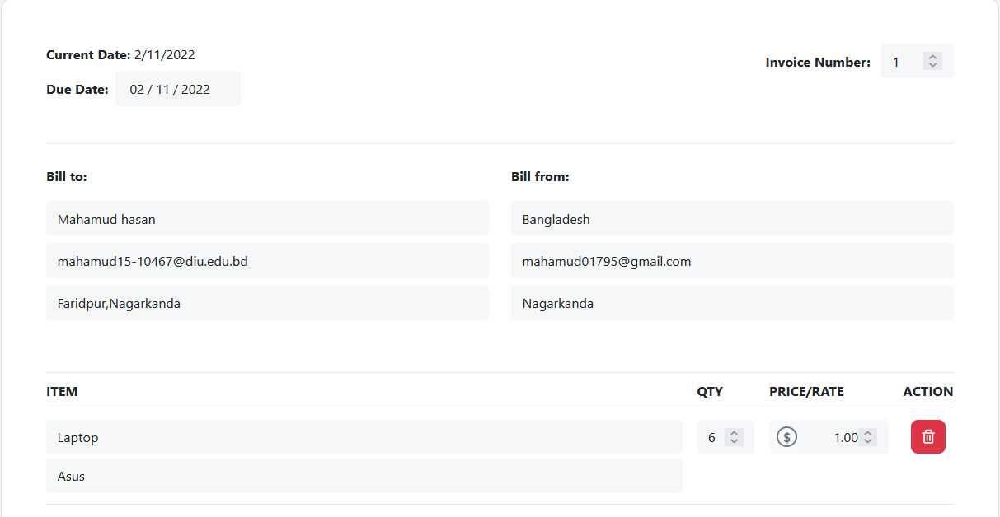
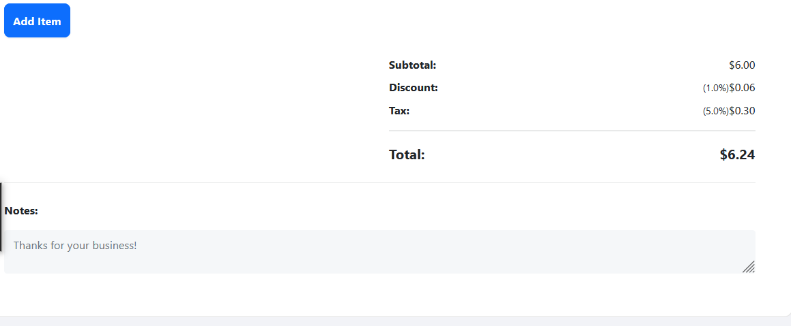
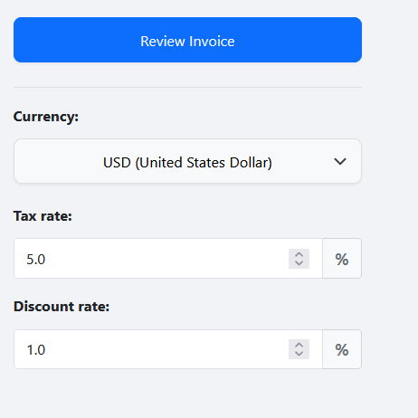

# Invoice Of Generator🧾

An Invoice Creator project that built with React. Add itemized items, configure quantity, prices, tax rates and discounts & Download Invoice as PDFs to your device. Uses [jspdf-react](https://www.npmjs.com/package/jspdf-react) to capture the data from the modal & Convert it from canvas -> PDF.


##### HomePage




##### UserProfile




##### Review Invoice




##### Download Copy


### Installation

```
git clone https://github.com/MahamudM90/INVOICE-GENERATOR

npm install

npm start / npm run build
```

### To-Do
- [x] Finish parsing data into Preview Modal.

- [x] Currency Picker.

- [x] Calculate Tax & Discounts.

- [ ] Store invoices in Firebase DB.


 ###    [Live Site](https://invoice-generator-react.netlify.app/) 
